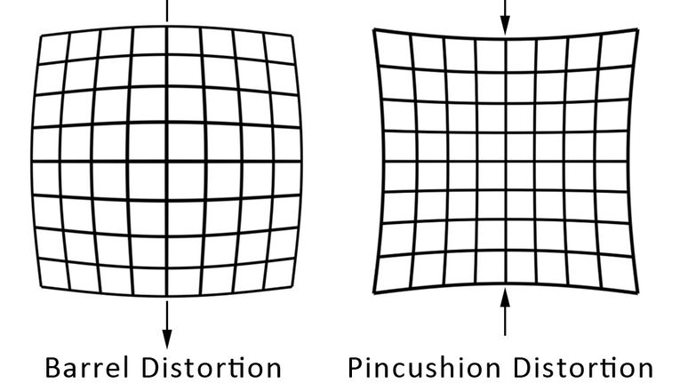
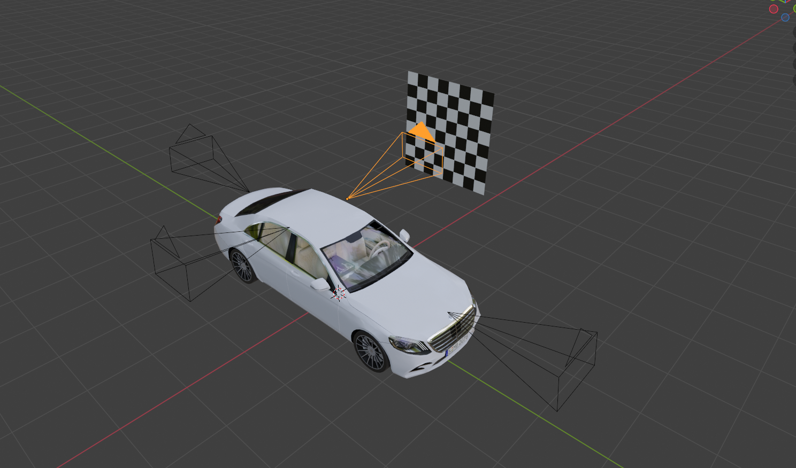

# Fisheye-Camera-Calibration 
*Performing fish eye camera calibration by obtaining images from simulating a fisheye camera in blender.* 

Fisheye cameras deviate from the traditional pinhole camera model in terms of their optics and resulting image projection. Instead of using a small aperture and relying on perspective projection, fisheye cameras typically use wide-angle lenses with a highly curved field of view. This results in a distinct fisheye effect where straight lines in the scene are heavily distorted, appearing curved in the image. The adantages of using lens in cameras are wider field of view, more light exposure. However, they also introduce additional distortion in images such barrel distortion and pincusion distortion. Thus, we have to find the distortion coefficients to correct the distortion.

### Intrinsic parameters:

These parameters characterize the internal geometry and optical properties of the camera. The primary intrinsic parameters include:

Focal Length (f): The distance from the camera's optical center (the pinhole or lens) to the image sensor or film plane when focused at infinity. It determines the scale of the scene in the image.

Principal Point (u₀, v₀): The coordinates of the principal point, which is the intersection point of the optical axis with the image plane. It represents the offset of the image sensor's origin from the top-left corner of the image.

### Extrinsic parameters:
These parameters define the transformation from the camera's local coordinate system to the global coordinate system. The primary extrinsic parameters include:

Rotation Matrix (R): A 3x3 matrix representing the rotation of the camera with respect to the global coordinate system. It describes how the camera's axes are oriented relative to the world axes.

Translation Vector (t): A 3x1 vector representing the translation of the camera's optical center from the origin of the global coordinate system. It specifies the position of the camera in 3D space.

### Lens Distortion: 
Distortions caused by imperfections in the camera's lens system, including radial distortion (barrel distortion or pincushion distortion) and tangential distortion. Distortion parameters are often represented using radial and tangential distortion coefficients.

# Method

A model of a car is downloaded from the web. A fish-eye camera is mounted on the model mounted . The camera has a focal length of 10.50 mm and a field of view of 120 degrees.

A model of a chessboard is downloaded from the web and placed in the field of view of the camera. An image of the view is captured. The chessboard is moved in the field of view of the camera to obtain numerous images from different angles. The images obtained are preset in the repository.

In order to perform the camera calibration and distortion correction, we need to obtain camera matrix, distortion coefficients, translation matrix and rotation matrix.

## Camera Calibration

The code performs camera calibration using a checkerboard pattern. It utilizes OpenCV's camera calibration functions to estimate camera intrinsic and extrinsic parameters, as well as to undistort images captured by the camera.

### Object Points Preparation

Object points, representing the coordinates of corners on the checkerboard pattern in the real-world space, are generated.

### Image Points Collection

Image points, representing the coordinates of detected corners on the checkerboard pattern in the image plane, are collected from a set of images.

### Camera Calibration

The collected object points and image points are used to calibrate the camera, resulting in camera matrix (`mtx`), distortion coefficients (`dist`), rotation vectors (`rvecs`), and translation vectors (`tvecs`).

### Undistortion

The obtained camera calibration parameters are used to undistort images captured by the camera. The `undistort` function is applied to remove lens distortion, followed by cropping to remove black borders.

